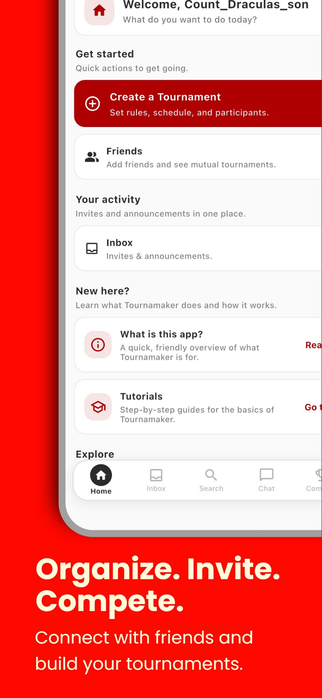
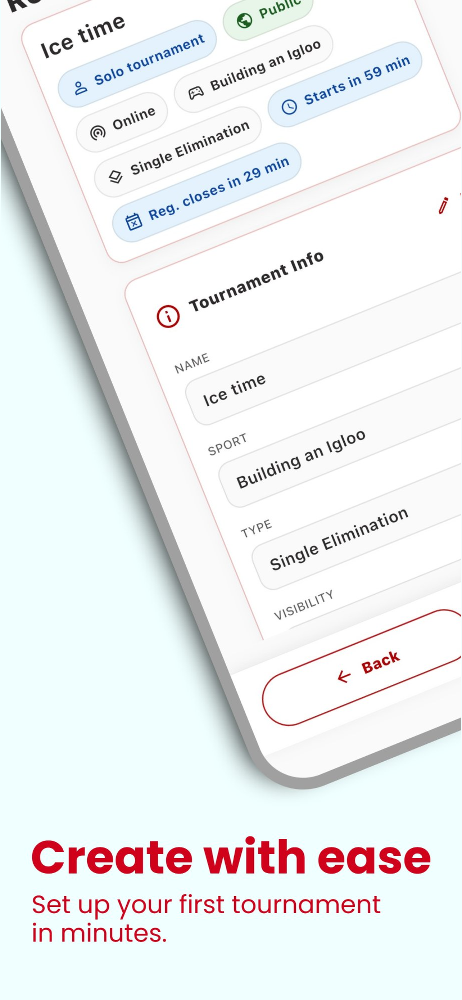
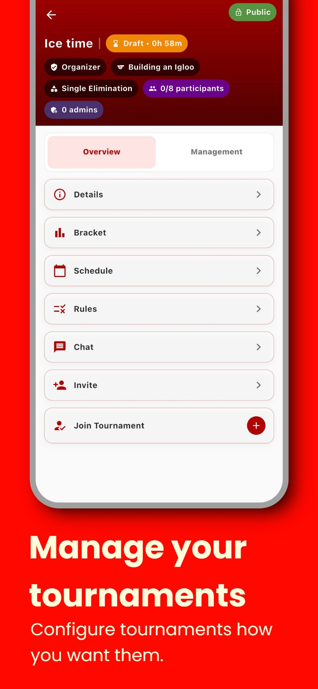
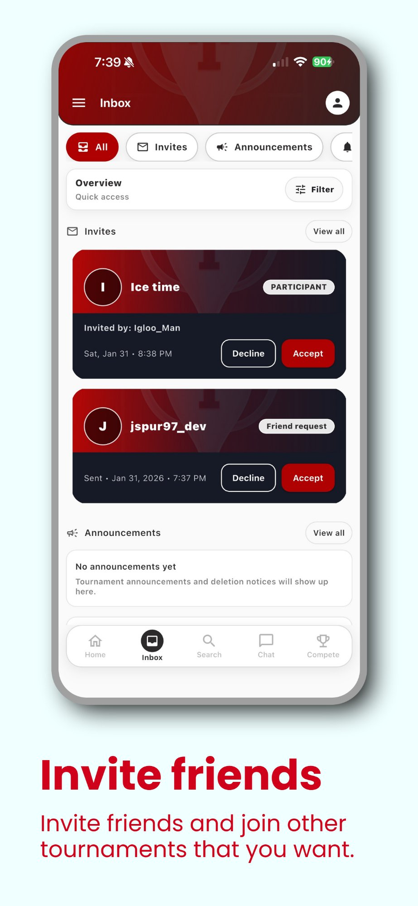
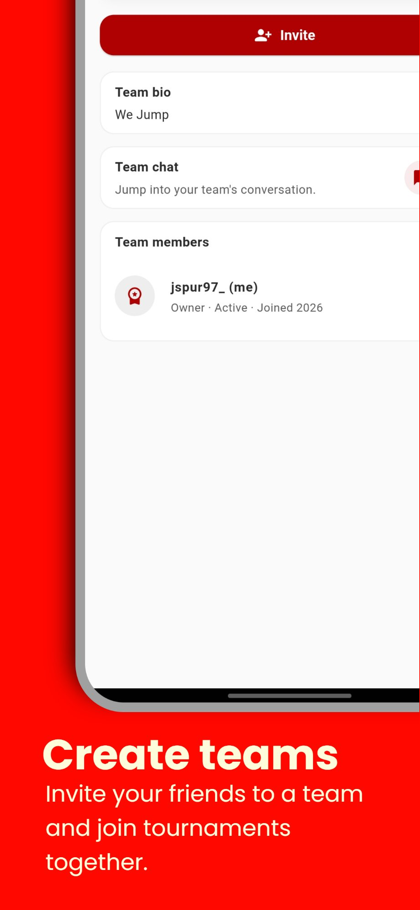

# Tournamaker Arena

A cross-platform tournament and league management app for iOS and Android.

## What it does
- Create and manage tournaments and leagues for any sport or game
- Configure brackets, schedules, rules, and participant limits
- Invite friends and manage teams
- In-app inbox for invites and tournament announcements
- Real-time chat per tournament and team
- Public and private tournament visibility
- In-app purchases via Stripe

## Tech Stack
- **Framework:** Flutter (Dart)
- **Backend:** Firebase (Auth, Firestore, Cloud Functions)
- **Payments:** Stripe
- **Platforms:** iOS & Android
- **Distribution:** App Store & Google Play

## Screenshots

| Home | Create | Manage | Inbox | Teams |
|------|--------|--------|-------|-------|
|  |  |  |  |  |
